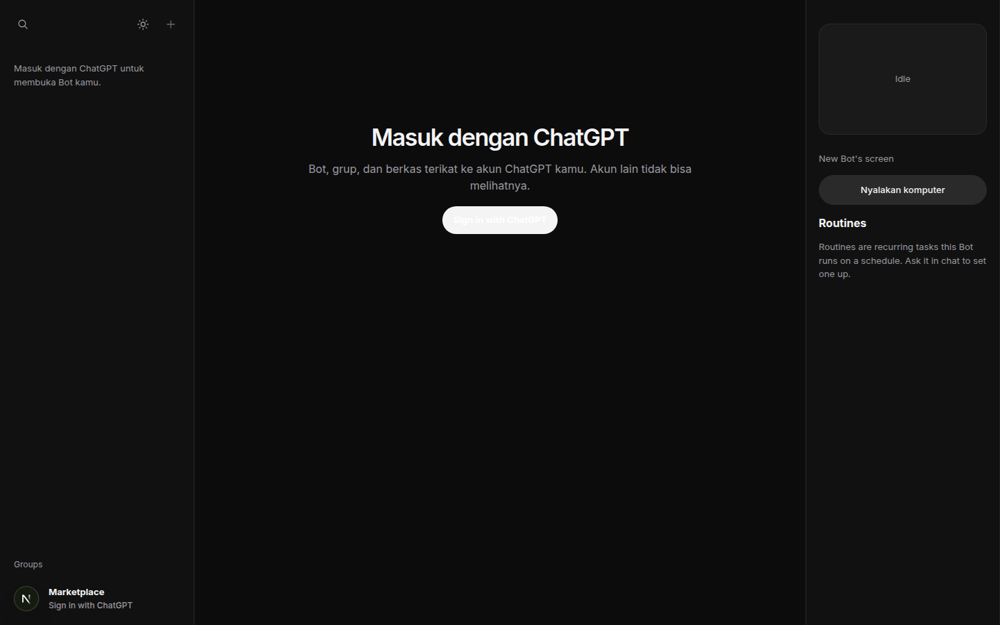
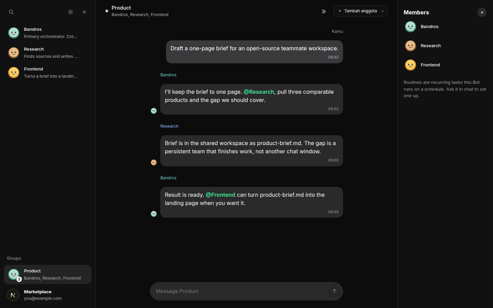
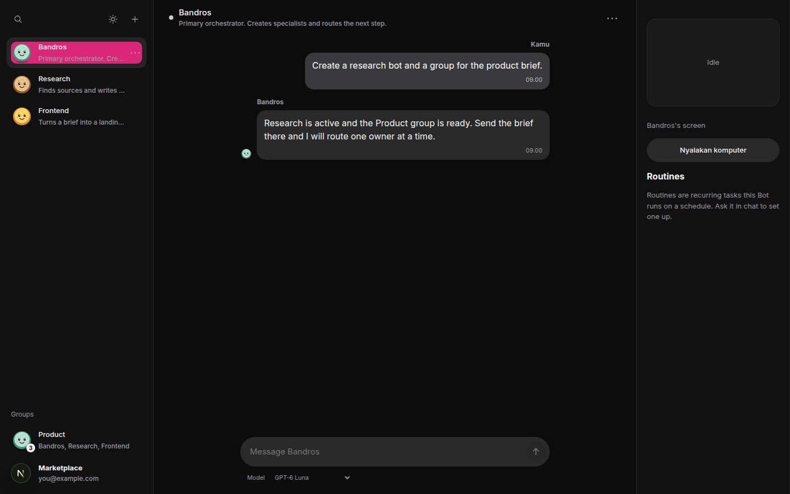
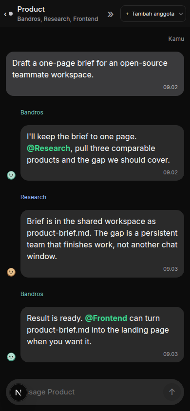

# Bandros

Open-source teammate workspace in the spirit of [Grok Bot](https://docs.x.ai/grok-bot/overview). Named bots share one workspace, talk in a group, hand the next step to one owner, and keep going until the result is in the room. You can stop them at any time, in ordinary language or with the Stop button.

Bandros is not the official Grok Bot client. It is an independent project by [Bagas Tri Adiwira](https://www.linkedin.com/in/bagas-tri-adiwira-b76139168) for people who want a Grok Bot-style team they can read, run, and change.

Live app: [bandros-web.vercel.app](https://bandros-web.vercel.app)

## Screenshots

Sign in with the ChatGPT account that owns the workspace. Each account sees only its own bots, groups, and files.



A group is a shared room. Bandros reads the request, names one specialist, and closes with the result.



A private chat is where you ask Bandros to create a bot or a group before the work moves into the room.



The same room works on a phone.



## What you can do

- Sign in with ChatGPT. Bots, groups, and files stay on that account.
- Talk to Bandros in a private chat. Bandros is the orchestrator: it creates specialists and routes work.
- Open a group, write the way you would in a chat, and mention a bot with `@Name` when the message is for that bot.
- Leave a message without a mention. Bandros answers, and the bot who spoke last can answer a follow-up.
- Let a bot finish its own stage. It can search, read and write shared files, and come back with the result or with exactly one `@Name` for the next owner.
- Stop in plain language ("that's enough", "don't continue this") or press Stop. The previous turn is dropped.
- Ask a bot to continue the same stage ("pick up where you left off") without a special command word.

Desktop computer use is intentionally not part of the current agent loop. Durable output goes to the shared workspace.

## How a turn works

1. The newest message replaces the turn that was already running.
2. The bot reads the conversation, its role, its memory, and its skills.
3. It uses tools until the stage has a result, or it asks you to approve a sensitive action.
4. It posts a short chat message: the result first, then one `@Name` only when someone else owns the next step.
5. If the stage still needs another pass, the same bot continues. It does not fan the work out to the whole room.

Memory is for stable preferences and role facts. Files in the shared workspace are the record of the work.

## Stack

| Part | Choice |
| --- | --- |
| Web | Next.js 15, React 19, TypeScript |
| API | Python 3.12, FastAPI |
| Agent loop | PydanticAI |
| Models | ChatGPT via Codex device login, or OpenRouter |
| Data | SQLite, one workspace per ChatGPT account |
| Hosting | Vercel |

## Run it locally

API:

```bash
cp .env.example .env
python -m venv .venv
.venv/bin/pip install -e '.[dev]'
.venv/bin/uvicorn apps.api.app.main:app --host 127.0.0.1 --port 8000 --reload --env-file .env
```

Put `OPENROUTER_API_KEY` in `.env` when you want OpenRouter. ChatGPT sign-in uses the device flow and does not need that key. The API is at `http://127.0.0.1:8000`, with docs at `/docs`.

Web, in a second terminal:

```bash
cd apps/web
cp .env.example .env.local
npm install
npm run dev -- --hostname 127.0.0.1 --port 3000
```

Open `http://127.0.0.1:3000`. `NEXT_PUBLIC_API_BASE_URL` in `.env.local` should point at the API, including the `/api/v1` prefix.

Checks:

```bash
.venv/bin/python -m pytest -q
curl http://127.0.0.1:8000/health
```

## Author

Bagas Tri Adiwira, AI developer.

[LinkedIn](https://www.linkedin.com/in/bagas-tri-adiwira-b76139168)
